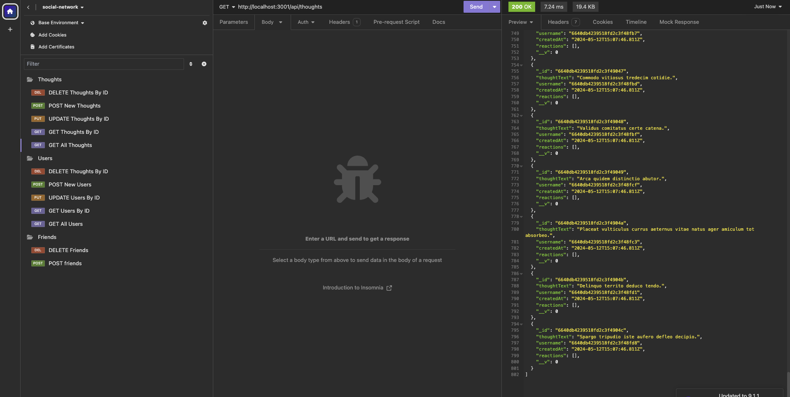
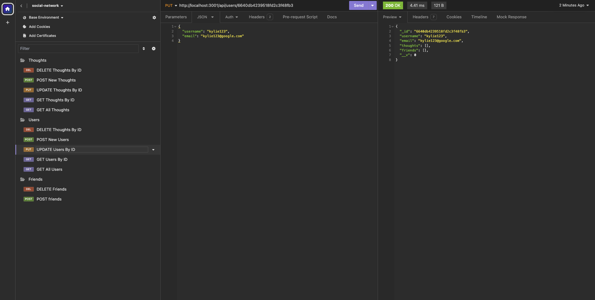
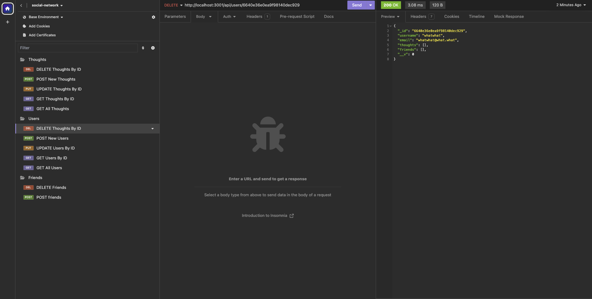

# NoSQL Social Network API

Ryan Hanzel

Module 18 | BootCamp @ UT Austin

## Description

My app is a social network api app that allows you to utilize the api path to modify/add/delete user and thought data. The app is designed to work with any api interfacing tools. 

## Usage

- Clone the GitHub repo and switch to the root directory in your terminal app
- Run `npm install`
- Ensure your MongoDB server is running and accessible
- Run `npm run seed`
- Run `npm start`
- Open the Insomnia App and point your GET request to http://localhost:3001/api `/users` or `/thoughts` to get all of the database data.
- You can add new users and thoughts with POST request
- You can delete users/thoughts by id with DELETE request (ex:`http://localhost:3001/api/users/id#`)
- You can update user/thought by id with the PUT request
- You can also look up user/thought by id as well

## Links

[GitHub](https://github.com/h3xivall/nosql-social-network)

## ScreenShots

